# Отчёт по заданию U0: Настройка окружения

## Цели задания
Настроить полное окружение:
1. Браузер для работы и поиска информации
2. Интегрированную среду разработки (IDE)
3. Java Development Kit (JDK) и среду выполнения (JRE)
4. Систему сборки проектов 
5. Драйвер для автоматизации браузера
6. Систему контроля версий

---

## Часть 1: Установка Google Chrome

### Процесс установки

1. **Переход на официальный сайт**  
   Открыть любой браузер и перейти на страницу загрузки Google Chrome: `https://www.google.com/chrome`.
   <br>
   <br>*Скриншот 1: «Страница загрузки Chrome» — виден интерфейс сайта с кнопкой «Скачать Chrome»*

2. **Скачивание и запуск установщика**  
   Нажать на кнопку «Скачать Chrome». Начинается загрузка файла установщика `ChromeSetup.exe`. После завершения загрузки запустить его двойным щелчком мыши.
   <br>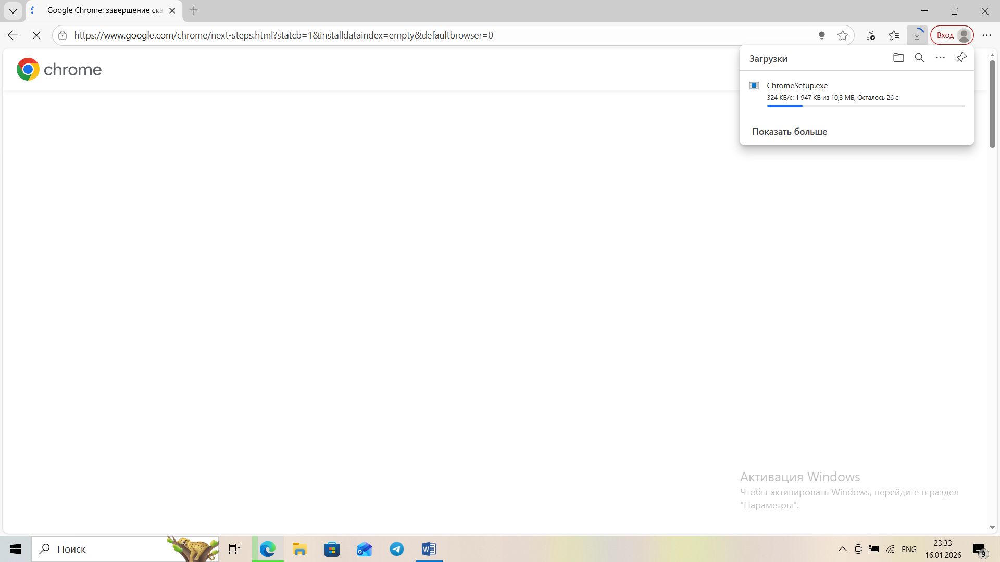
   <br>*Скриншот 2: «Процесс скачивания» — окно загрузки в браузере с именем файла и индикатором прогресса*

3. **Процесс установки**  
   Установщик автоматически начинает распаковку и установку браузера. Никаких дополнительных настроек выбирать не требуется. После окончания процесса установщик закрывает своё окно, а на рабочем столе появляется ярлык Google Chrome.
   <br>
   <br>*Скриншот 3: «Ход установки» — окно установщика с индикатором прогресса*

4. **Первый запуск браузера**  
   Двойным щелчком открыть ярлык Chrome. Появляется стартовое окно браузера.
   <br>
   <br>*Скриншот 4: «Первое открытие Chrome» — открытое окно браузера с начальной страницей*

5. **Проверка версии браузера**
    - Нажать на три точки (меню) в правом верхнем углу.
    - Выбрать «Справка» → «О браузере Google Chrome».  
      На открывшейся странице отображается текущая версия.
      <br>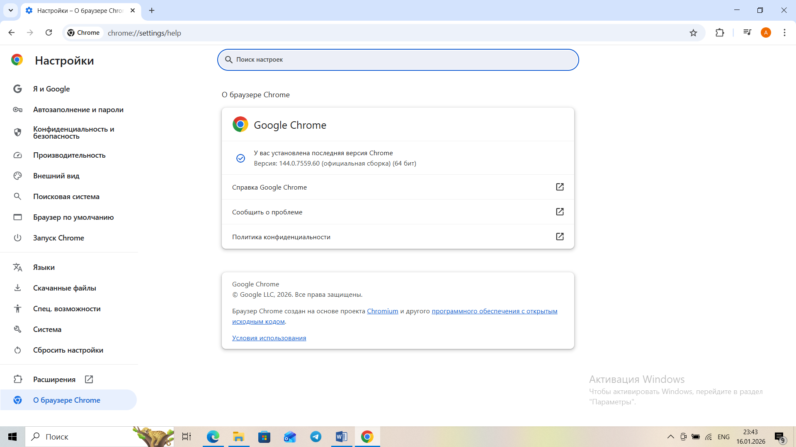
      <br>*Скриншот 5: «Страница „О браузере“» — экран с указанием версии Chrome*
   
---

## Часть 2. Установка IntelliJ IDEA

### 1. Загрузка дистрибутива
- Перейти на официальный сайт JetBrains (https://www.jetbrains.com/idea/download/other.html#releases-2024).
- Выбрать версию **Community Edition 2024.3**.
- Загрузить установочный файл под соответствующую ОС.
  <br>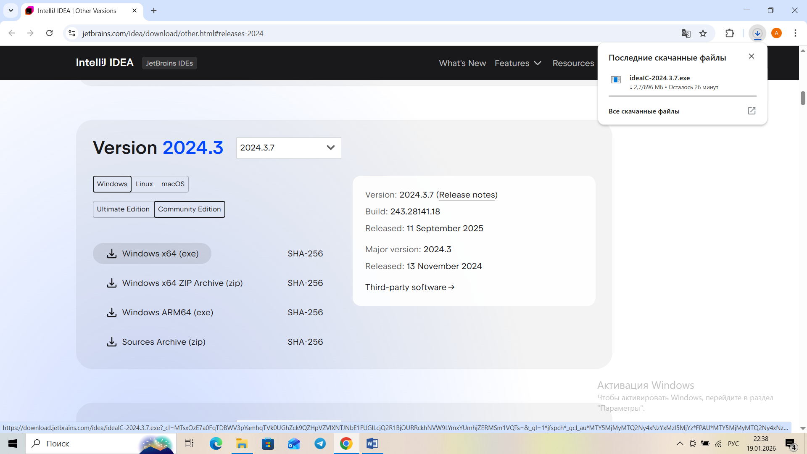
  <br>*Скриншот 6: «Страница загрузки IntelliJ IDEA Community Edition 2024.3» — виден интерфейс сайта с кнопкой «Windows x64 (exe)»*

### 2. Запуск установщика
- Открыть скаченный файл.
- В стартовом окне — нажать кнопку **Next**.
  <br>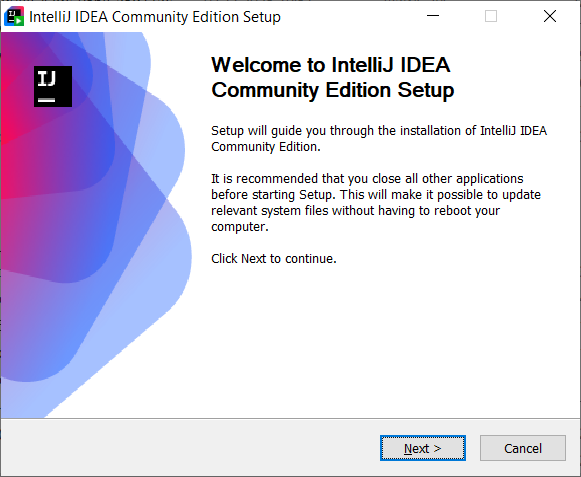
  <br>*Скриншот 7: «Приветственное окно установки»*

### 3. Путь установки
- Сохранить путь по умолчанию (`C:\Program Files\JetBrains\IntelliJ IDEA Community Edition 2024.3` или аналог для вашей ОС).
- Нажатие **Next**.
  <br>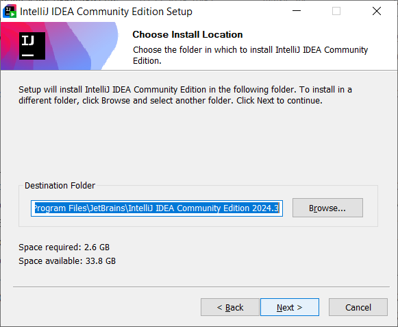
  <br>*Скриншот 8: «Выбор пути установки»*

### 4. Параметры установки
Отметить опции:
- `Create Desktop Shortcut` (ярлык на рабочем столе);
- `Add "bin" folder to the PATH` (добавление в системный путь);
- `Add "Open Folder as Project"` (добавление пункта "Open Folder as Project" в контекстное меню проводника);
- `Associate .java, .gradle and .pom files with IntelliJ IDEA` (ассоциация файлов Java, Gradle и Maven с IntelliJ IDEA); 
  <br>Нажатие **Next**.
  <br>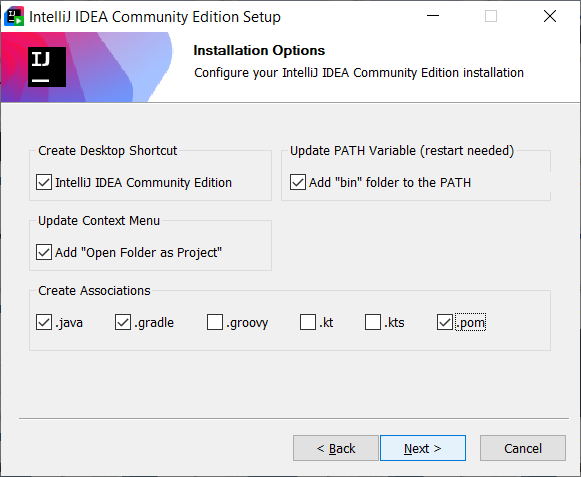
  <br>*Скриншот 9: «Выбор необходимых параметров»*

### 5. Меню «Пуск»
- Сохранение настроек по умолчанию.
- Нажатие **Next**.
  <br>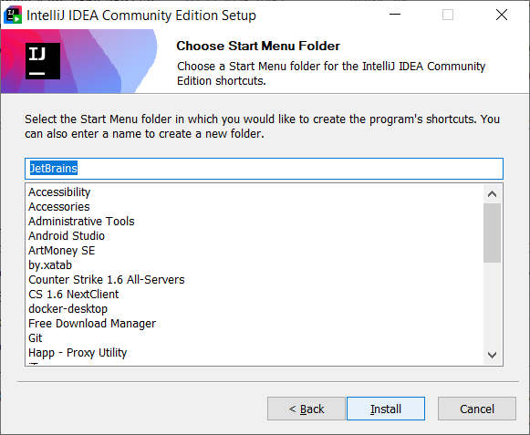
  <br>*Скриншот 10: «Выбор папки для меню „Пуск“»*

### 6. Начало установки
- Нажатие **Install**.
- Ожидание завершения процесса (прогресс-бар).

<br>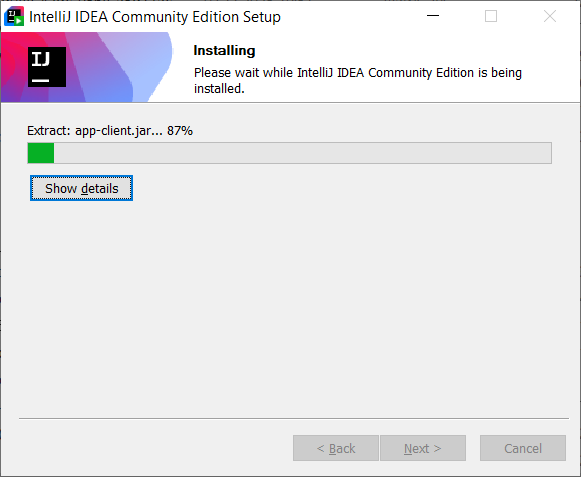
<br>*Скриншот 11: «Процесс установки»*

### 7. Завершение
- Отметка опции **Reboot now** (перезагрузка после установки).
- Нажатие **Finish**.

<br>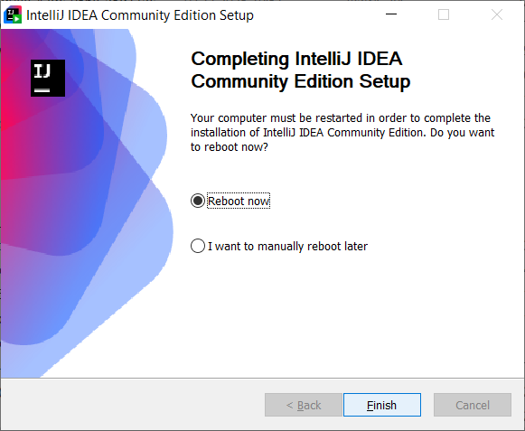
<br>*Скриншот 12: «Завершающие окно установки»*  

После перезагрузки:
### 8. Запуск IntelliJ IDEA через ярлык или меню «Пуск». Появление главного окна с опциями:
- **New Project** — создание нового проекта;
- **Open** — открытие существующего;
- **Clone Repository** — клонирование репозитория.
  <br>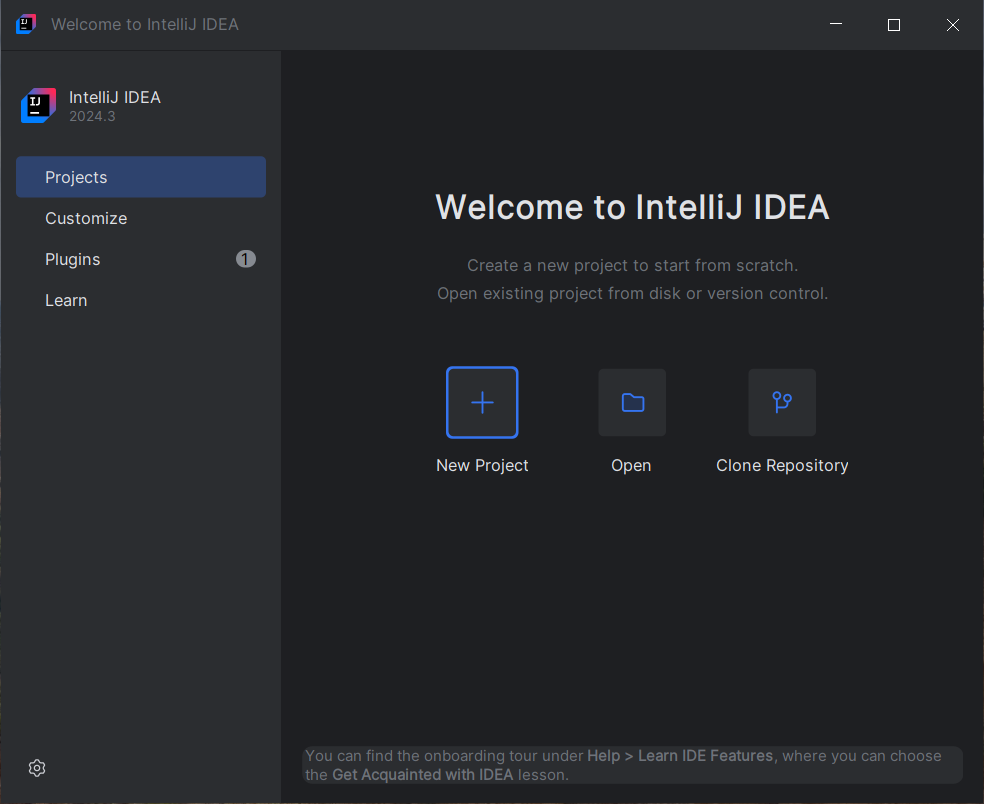
  <br>*Скриншот 13: «Окно программы»*  

### 9. Проверка установки и версии
- В открывшемся окне IDEA перейти в меню **Help** → **About**
- Убедиться, что отображается версия **2024.3**
- Проверить, что среда запускается без ошибок
  <br>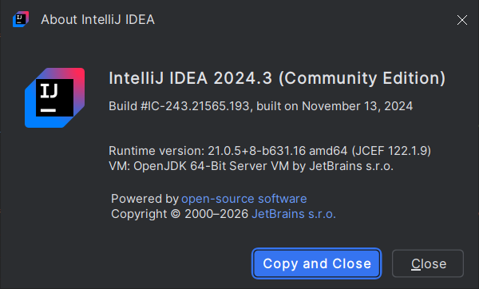
  <br>*Скриншот 14: «Окно About IntelliJ IDEA с информацией о версии 2024.3»*

---

## Часть 3: Установка Java JDK и JRE, настройка переменных окружения

## Цели части

- Установить Java Development Kit (JDK) и Java Runtime Environment (JRE).
- Настроить системные переменные окружения.
- Проверить корректность установки и настройки.

## Процесс установки JDK и JRE

### 1. Загрузка установщика

- Перейти на официальный сайт Oracle для загрузки JDK.
- Выбрать подходящую версию для операционной системы.
- Загрузить установочный файл `jdk-8u471-windows-x64.exe`.

  <br>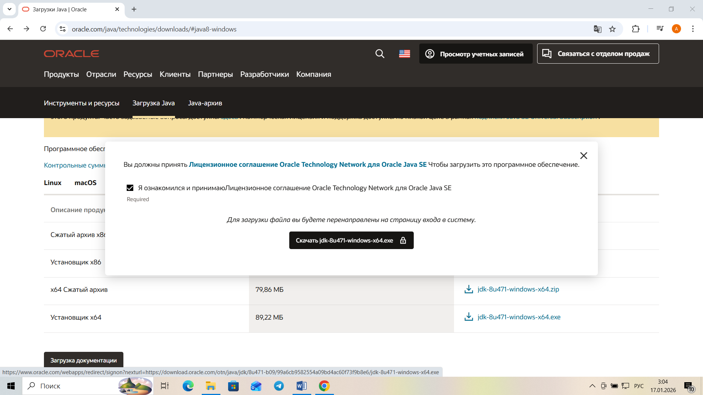  
  <br>*Скриншот 15: «Страница загрузки JDK» — виден интерфейс сайта с кнопкой загрузки.*

### 2. Начало установки JDK 8

- Запустить скачанный установочный файл `jdk-8u471-windows-x64.exe`.
- Внимательно ознакомиться с важными изменениями:
    - Лицензионное соглашение обновлено.
    - Java Mission Control (JMC) больше не включён в состав JDK.
    - JavaFX больше не включён в состав JDK.
- Нажать кнопку **Next**.

<br>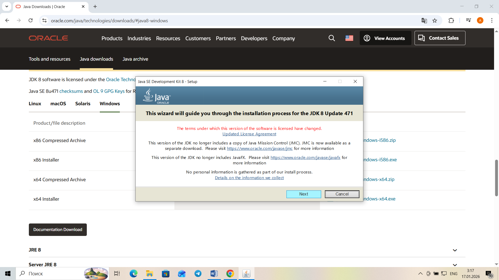  
<br>*Скриншот 16: «Окно мастера установки JDK 8» — начальный экран с важной информацией об изменениях.*

### 3. Выбор компонентов для установки

- Оставить все компоненты по умолчанию:
    - Development Tools (основные инструменты разработки);
    - Source Code (исходный код);
    - Public JRE (общедоступная среда выполнения).
- Нажать кнопку **Next**.
- Ожидать завершения процесса установки.
> **Важно:** Запомнить путь установки, выделенный в окне (в данном случае — `C:\Program Files\Java\jdk-1.8\`). 

  <br>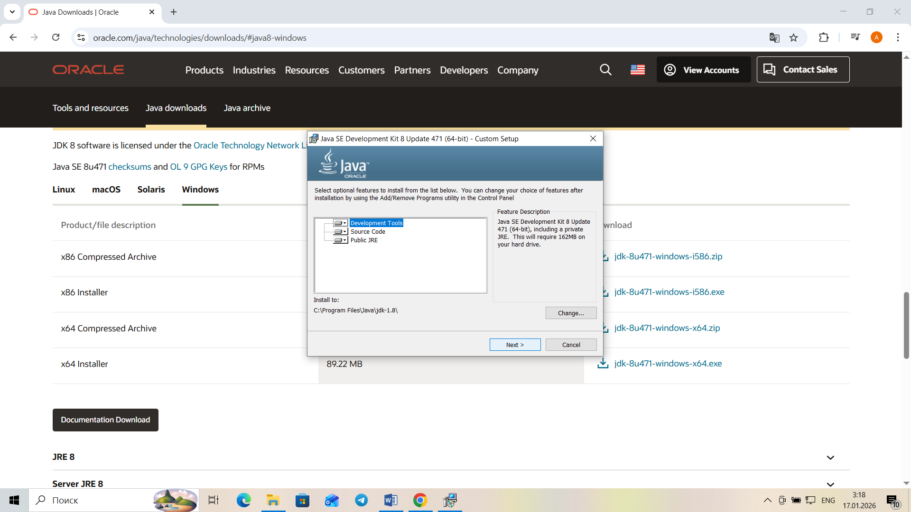  
  <br>*Скриншот 17: «Выбор компонентов и путь установки» — виден путь `C:\Program Files\Java\jdk-1.8\`.*

  <br>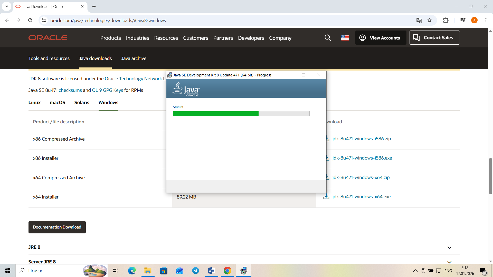  
  <br>*Скриншот 18: «Установка Java» — индикатор выполнения установки.*

### 4. Выбор папки для JRE (если выбрана)

> **Примечание:** Этот шаг появляется, если на шаге 2 был выбран компонент *Public JRE*.

- Появляется окно выбора папки для установки JRE.
- По умолчанию предлагается путь: `C:\Program Files\Java\jre1.8.0_471`.
- При необходимости изменить путь:
    - нажать кнопку **Change**;
    - выбрать нужную директорию;
    - подтвердить выбор.
- Нажать кнопку **Next** для продолжения установки.

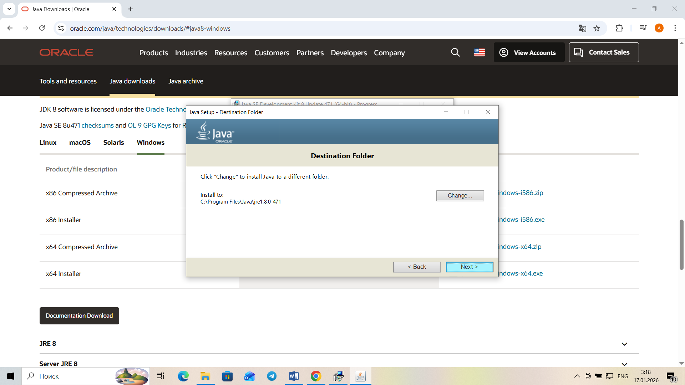  
*Скриншот 19: «Выбор папки для JRE» — указание пути установки среды выполнения Java.*


### 5. Активная установка Java

- Непосредственная установка Java в систему.
- Отображается индикатор с текстом **Status: Installing Java**.
- Идёт копирование файлов и их регистрация в системе.

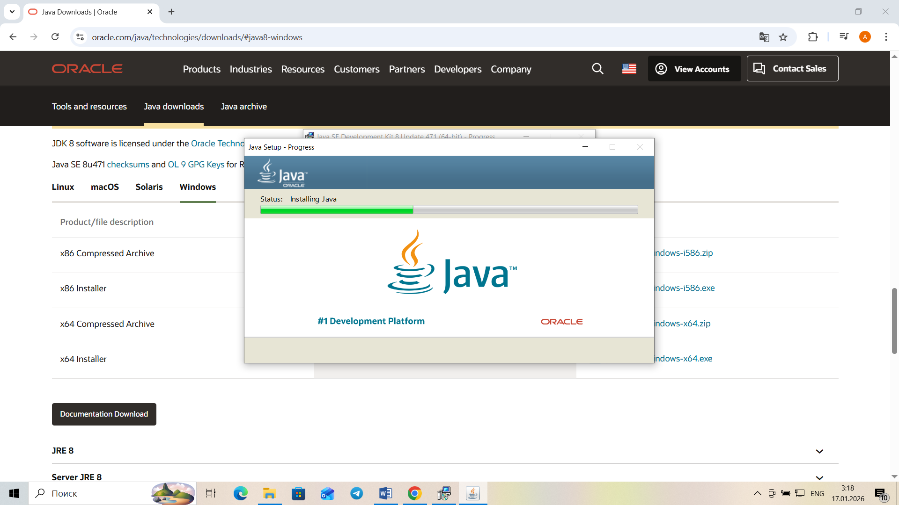  
*Скриншот 20: «Установка Java» — активная фаза установки с логотипом Oracle.*
### 6. Завершение установки

- После успешной установки появится соответствующее уведомление.
- Появится предложение перейти к документации и руководствам.
- Нажать кнопку **Close** для завершения установки.

  <br>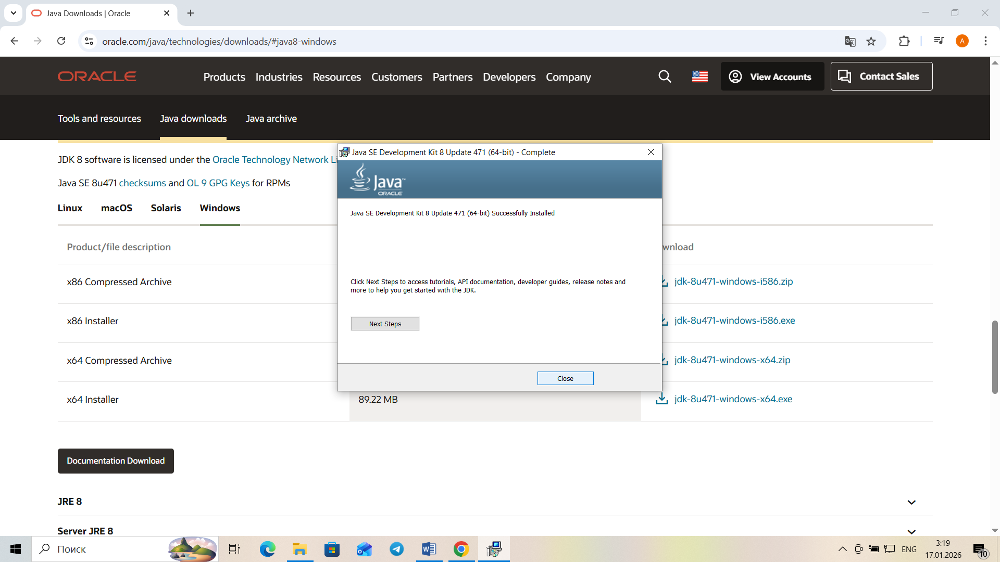  
  <br>*Скриншот 21: «Завершение установки JDK» — окно с сообщением об успешной установке.*

## Настройка переменных окружения

### 1. Открыть окно системных переменных

- Перейти в **Панель управления** → **Система** → **О системе**.
- Выбрать **Дополнительные параметры системы**.
- Нажать кнопку **Переменные среды**.

### 2. Создание переменной `JAVA_HOME`

- Нажать кнопку **Создать** в разделе системных переменных.
- Ввести **имя переменной**: `JAVA_HOME`.
- Ввести **значение переменной**: `C:\Program Files\Java\jdk-1.8` (путь, который нужно было запомнить на шаге 3).

  <br>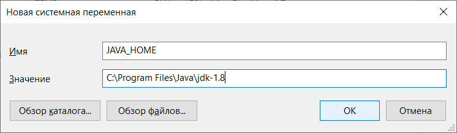  
  <br>*Скриншот 22: «Создание переменной JAVA_HOME» — окно ввода имени и значения.*

### 3. Добавление пути в переменную `PATH`

- В списке системных переменных выбрать переменную **`Path`**.
- Нажать кнопку **Изменить**.
- Добавить новую запись: `%JAVA_HOME%\bin`.
- Подтвердить изменения нажатием **ОК** во всех открытых окнах.

  <br>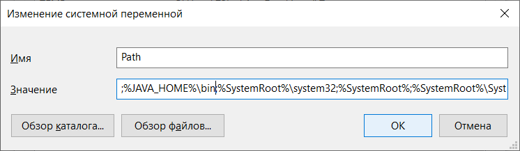  
  <br>*Скриншот 23: «Изменение переменной PATH» — добавление `%JAVA_HOME%\bin`.*

### 4. Создание переменной `JAVA`

- Нажать кнопку **Создать** в разделе системных переменных.
- Ввести **имя переменной**: `JAVA`.
- Ввести **значение переменной**: `%JAVA_HOME%\bin`.

  <br>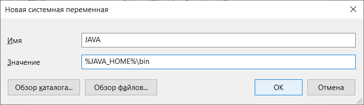  
  <br>*Скриншот 24: «Создание переменной JAVA» — окно ввода имени и значения.*

## Проверка установки

- Запуск `cmd.exe`.
- Выполнение следующих команд и анализ результатов:
```bash
java -version
javac -version
```

<br>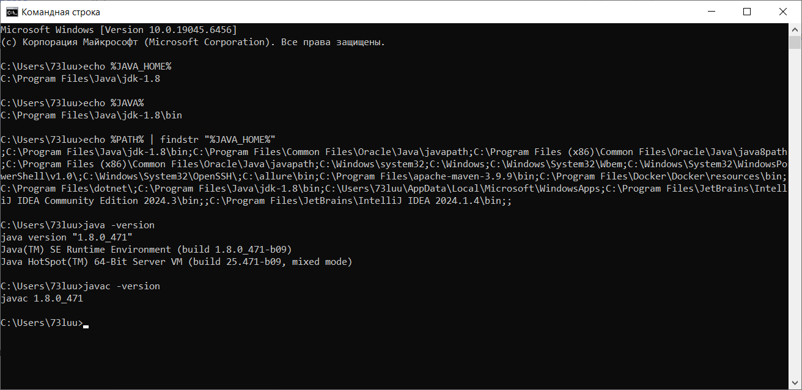  
<br>*Скриншот 25: «Проверка версий Java» — вывод команд `java -version` и `javac -version`.*

---

## Часть 4: Установка и настройка Apache Maven

## Цели части
- Установить систему сборки проектов Apache Maven.
- Настроить переменные окружения для работы Maven из командной строки.
- Проверить корректность установки и настройки.

### 1. Скачивание дистрибутива Apache Maven

- Перейти на официальный сайт Apache Maven: [https://maven.apache.org/download.cgi](https://maven.apache.org/download.cgi).
- Скачать архивную версию в формате ZIP под названием `apache-maven-v.v.v-bin.zip`.

<br>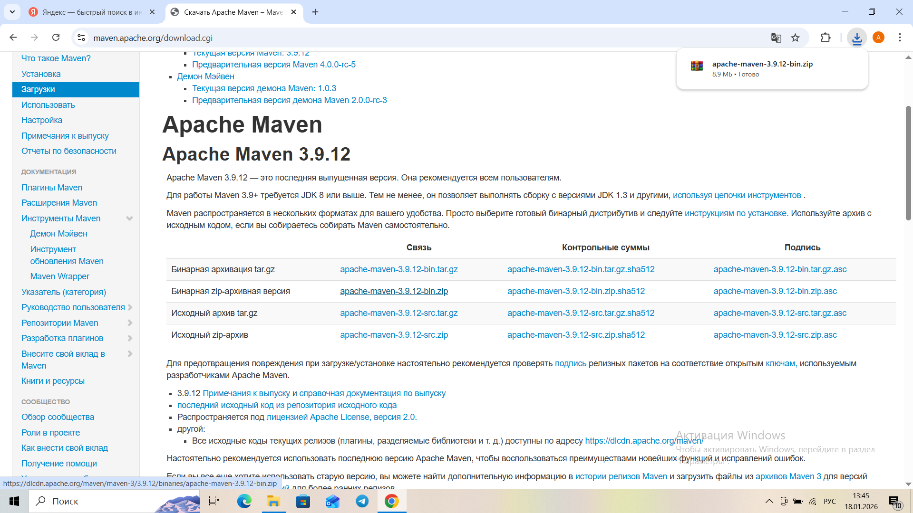  
<br>*Скриншот 26: «Загрузка архива Apache Maven с официального сайта» — интерфейс сайта с выделенной ссылкой для скачивания бинарного дистрибутива.*

### 2. Распаковка архива Maven

- Создать директорию: `C:\Program Files\Maven`.
- Распаковать содержимое скачанного архива в созданную директорию.
- В результате в указанной папке должна появиться структура с подкаталогами:
    - `bin`
    - `conf`
    - `lib`
    - и другими.

<br>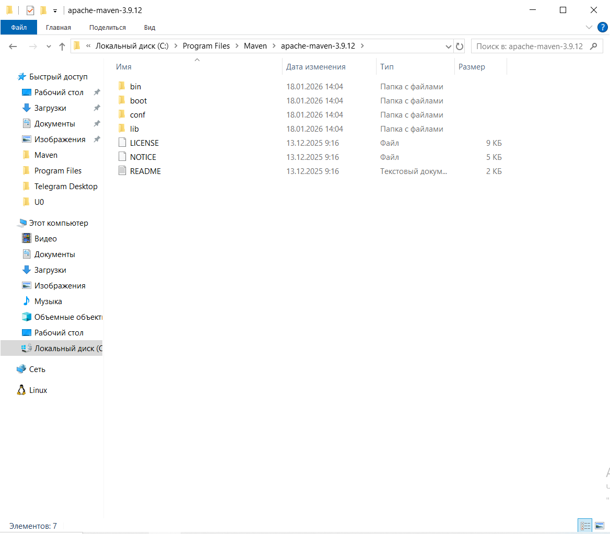  
<br>*Скриншот 27: «Содержимое распакованной директории Maven» — проводник Windows с отображением распакованных файлов Maven в `C:\Program Files\Maven\apache-maven-3.9.12`.*

### 3. Создание системной переменной MAVEN_HOME

- Открыть окно **Переменные среды**:  
  Перейти в **Панель управления** → **Система** → **О системе**.
- Выбрать **Дополнительные параметры системы**.
- Нажать кнопку **Переменные среды**.
- В разделе **Системные переменные** нажать кнопку **Создать**.
- Ввести **имя переменной**: `MAVEN_HOME`.
- Ввести **значение переменной**: `C:\Program Files\Maven\apache-maven-3.9.8` (укажите актуальный путь к распакованной папке Maven).

<br>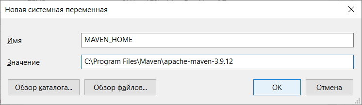  
<br>*Скриншот 28: «Создание переменной окружения MAVEN_HOME» — окно настройки переменной с указанием пути к установленному Maven.*

### 4. Добавление Maven в системный путь PATH

- В списке системных переменных выбрать переменную **`Path`**.
- Нажать кнопку **Изменить**.
- Добавить новую запись: `%MAVEN_HOME%\bin`.
- Подтвердить изменения нажатием **ОК** во всех открытых окнах.

<br>  
<br>*Скриншот 29: «Добавление пути Maven в переменную PATH» — окно редактирования переменной PATH с новой записью `%MAVEN_HOME%\bin`.*

### 5. Проверка работоспособности Maven

- Запустить новое окно командной строки (`cmd.exe`).
- Выполнить команду:
```bash
mvn -version
```
<br>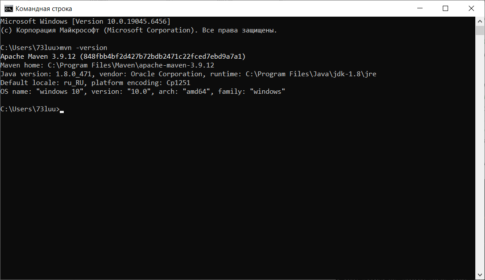  
<br>*Скриншот 30: «Проверка установки Maven выполнением команды mvn -version» — вывод в командной строке с информацией о версии Maven, Java и ОС.*

---

## Часть 5: Установка ChromeDriver для автоматизации браузера

## Цели части

- Скачать и настроить ChromeDriver для автоматизации тестов в Google Chrome.
- Добавить путь к драйверу в системные переменные окружения.
- Проверить корректность установки драйвера.

## Процесс установки ChromeDriver

### 1. Скачивание ChromeDriver с официального сайта

- Перейти на официальную страницу загрузки ChromeDriver: [https://chromedriver.chromium.org/downloads](https://chromedriver.chromium.org/downloads).
- Выбрать версию драйвера, совместимую с установленной версией Google Chrome.
- Скачать архив для Windows (`chromedriver_win64.zip`).

<br>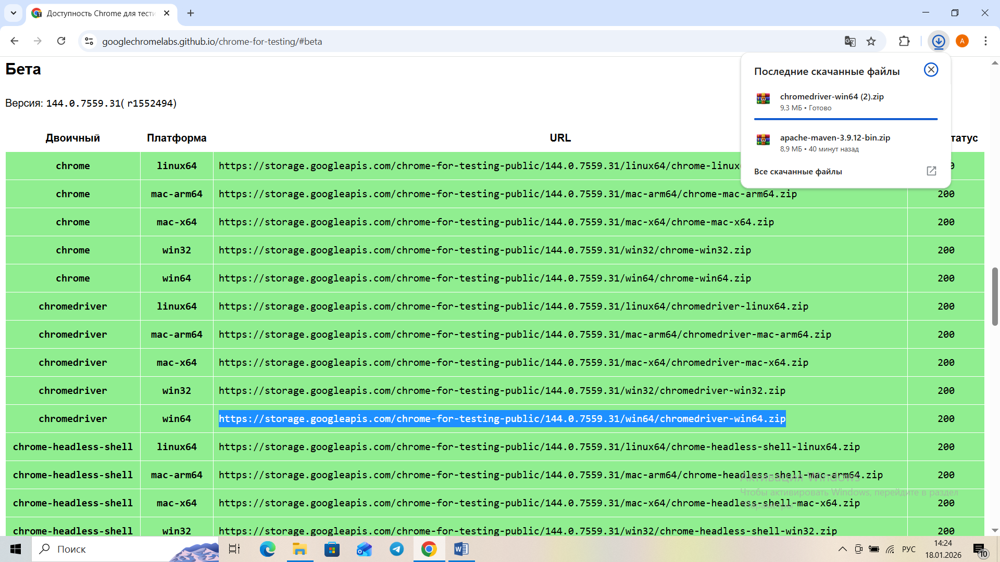  
<br>*Скриншот 31: «Страница загрузки ChromeDriver с официального сайта» — интерфейс сайта с доступными версиями драйвера и ссылками для скачивания.*

### 2. Создание системной папки для веб‑драйверов, извлечение и размещение драйвера

- Открыть проводник Windows и перейти в корень диска `C:\`.
- Создать новую папку с именем `webdrivers`.
- Распаковать скачанный архив `chromedriver_win64.zip`.
- Переместить файл `chromedriver.exe` в созданную папку: `C:\webdrivers`.

<br>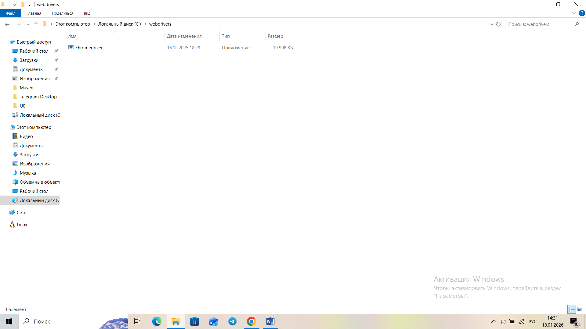  
<br>*Скриншот 32: «Файл chromedriver.exe в папке C:\webdrivers» — содержимое папки с размещённым драйвером.*

### 3. Добавление пути к драйверу в системную переменную PATH

- Открыть окно **Переменные среды**:  
  Перейти в **Панель управления** → **Система** → **О системе**.
- Выбрать **Дополнительные параметры системы**.
- Нажать кнопку **Переменные среды**.
- В списке системных переменных выбрать переменную **`Path`**.
- Нажать кнопку **Изменить**.
- Добавить новую запись: `C:\webdrivers`.
- Подтвердить изменения нажатием **ОК** во всех открытых окнах.

<br>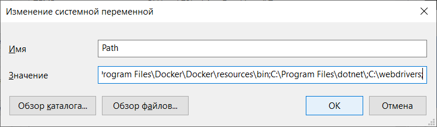  
<br>*Скриншот 34: «Добавление пути C:\webdrivers в переменную окружения PATH» — окно редактирования переменной PATH с новой записью.*

### 5. Проверка работоспособности ChromeDriver

- Запустить новое окно командной строки (`cmd.exe`).
- Выполнить команду:
```bash
chromedriver --version
```
<br>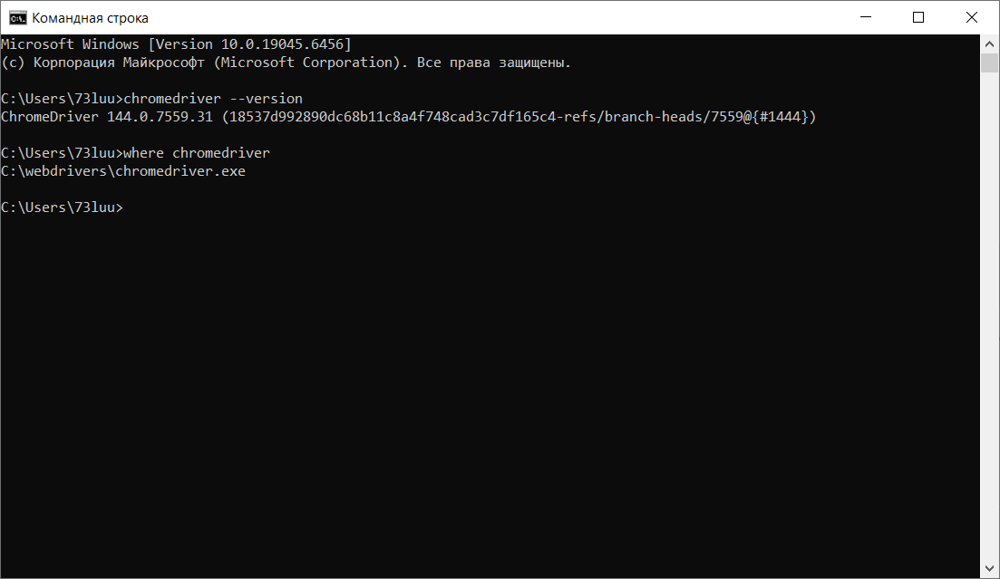  
<br>*Скриншот 35: «Проверка установки ChromeDriver через командную строку» — вывод в командной строке с информацией о версии ChromeDriver.*

---

## Часть 6: Установка и настройка системы контроля версий Git

## Цели части
- Установить систему контроля версий Git.
- Настроить основные параметры для работы в Windows.
- Проверить корректность установки и настройки.

## Процесс установки Git

### 1. Скачивание установщика Git для Windows

- Перейти на официальный сайт Git для Windows: [https://git-scm.com/download/win](https://git-scm.com/download/win).
- Скачать установочный файл соответствующей версии (`Git-2.52.0-64-bit.exe`).

<br>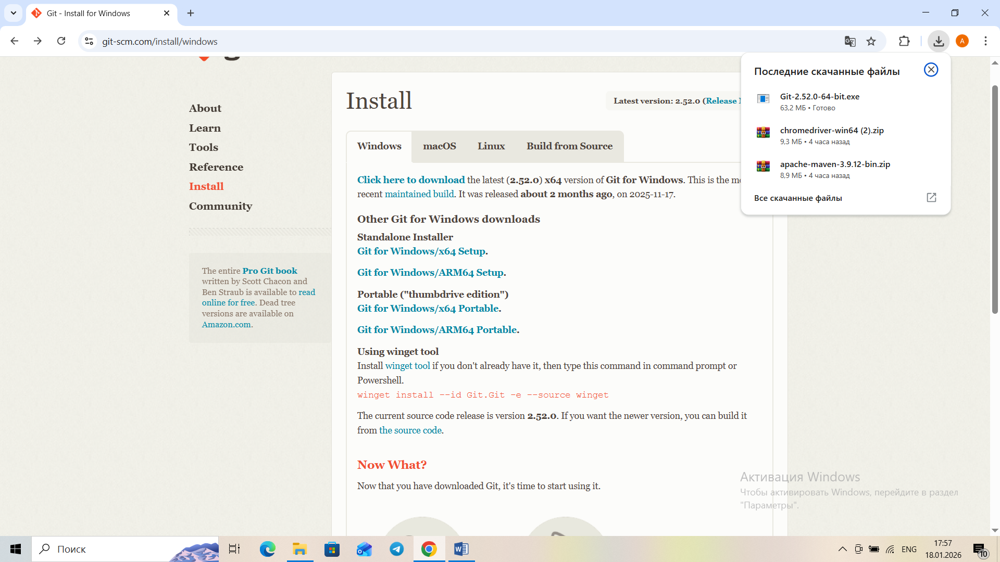  
<br>*Скриншот 36: «Страница загрузки установщика Git для Windows» — официальный сайт с ссылкой для скачивания.*

### 2. Запуск установщика и принятие лицензионного соглашения

- Запустить скачанный установочный файл.
- Ознакомиться с лицензионным соглашением **GNU General Public License**.
- Принять условия лицензии для продолжения установки.

<br>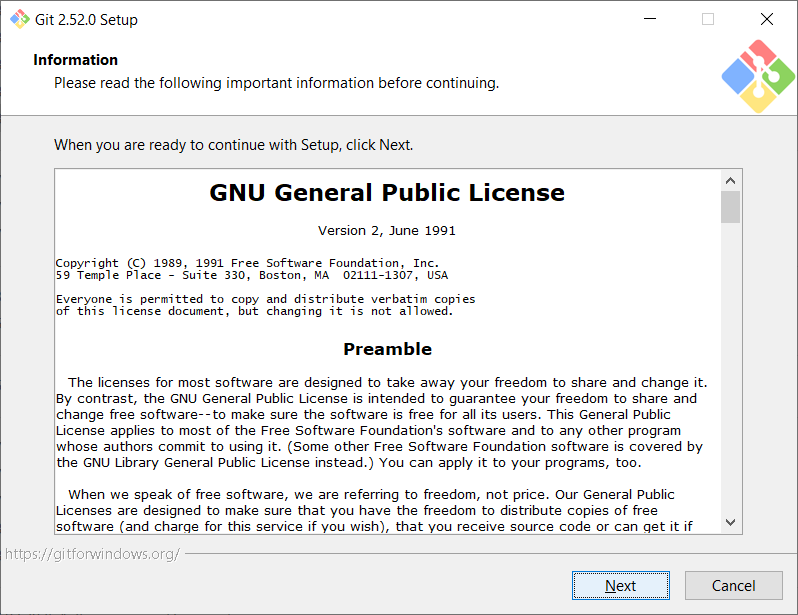  
<br>*Скриншот 37: «Окно лицензионного соглашения Git» — текст лицензии GPL с кнопкой Next.*

### 3. Выбор места установки Git

- Выбрать директорию для установки Git.
- По умолчанию предлагается путь: `C:\Program Files\Git`.
- При необходимости можно изменить расположение.

<br>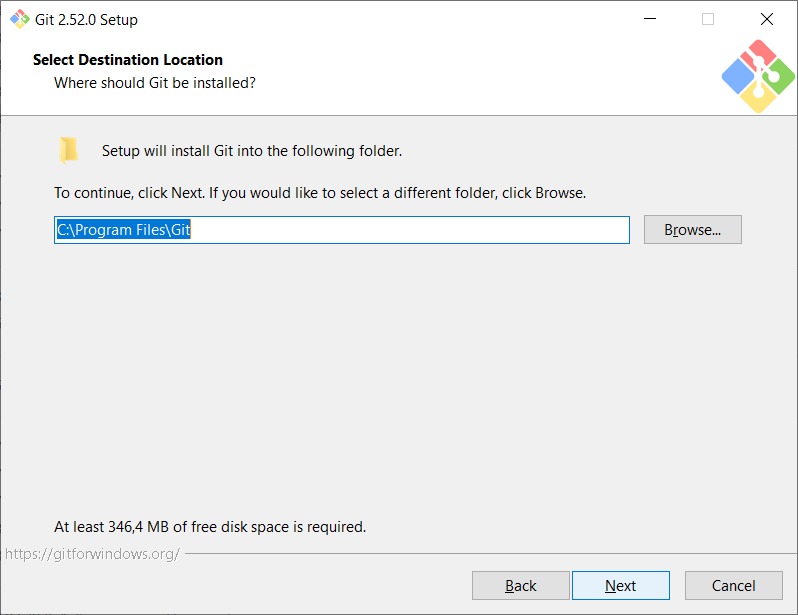  
<br>*Скриншот 38: «Выбор пути установки Git» — окно с указанием пути для установки.*

### 4. Выбор устанавливаемых компонентов

Выбрать необходимые компоненты для установки:
- **Git Bash** (интерфейс командной строки);
- **Git GUI** (графический интерфейс);
- интеграция с проводником Windows;
- ассоциации файлов.

<br>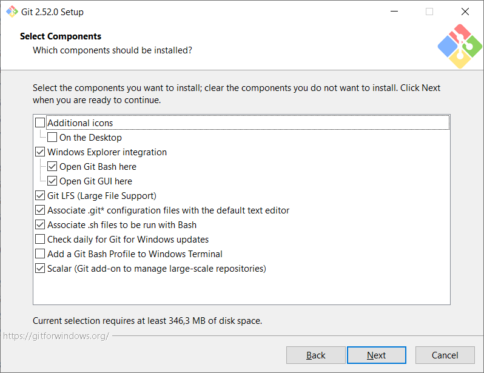  
<br>*Скриншот 39: «Выбор компонентов для установки Git» — список доступных компонентов с флажками выбора.*

### 5. Выбор имени папки в меню «Пуск»

- Указать имя папки для размещения ярлыков Git в меню «Пуск».
- По умолчанию используется имя: `Git`.

<br>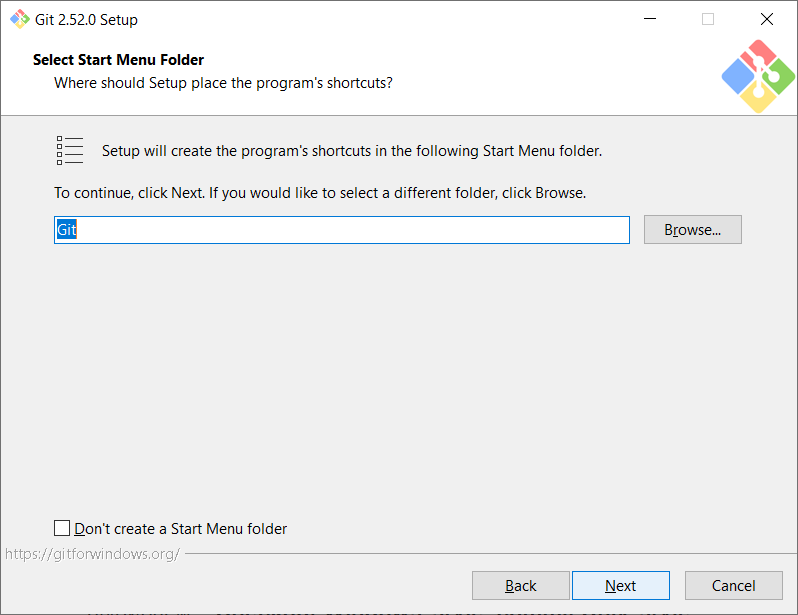  
<br>*Скриншот 40: «Настройка папки в меню Пуск для Git» — поле для ввода имени папки.*

### 6. Выбор редактора по умолчанию для Git

- Выбрать текстовый редактор, который будет использоваться Git по умолчанию.
- Доступные варианты: Vim, Nano, Notepad++, Visual Studio Code и другие.

<br>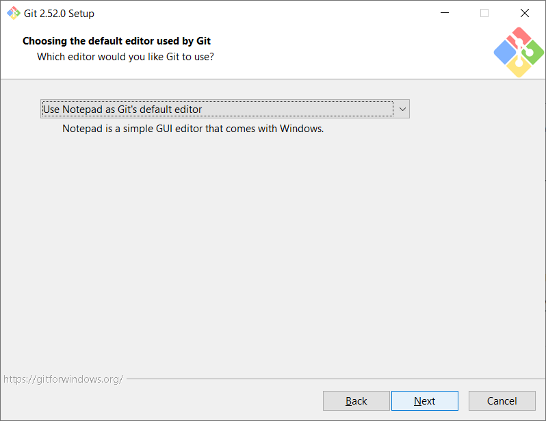  
<br>*Скриншот 41: «Выбор редактора по умолчанию для Git» — выпадающий список с доступными редакторами.*


### 7. Настройка имени начальной ветки в новых репозиториях

- Выбрать имя для начальной ветки.
- Возможные варианты:
    - `master` (традиционное название);
    - `main` (современный стандарт, рекомендованный многими платформами, включая GitHub).

<br>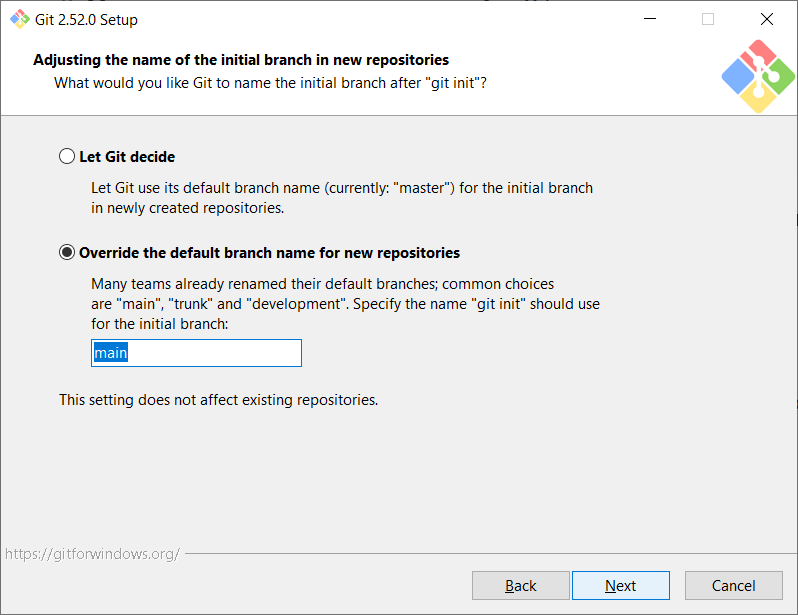  
<br>*Скриншот 42: «Настройка имени начальной ветки в Git» — опции выбора имени начальной ветки.*


### 8. Настройка интеграции Git с переменной окружения PATH

- Выбрать способ добавления Git в системную переменную `PATH`.
- Рекомендуемый вариант: **«Git from the command line and also from 3rd-party software»**.

<br>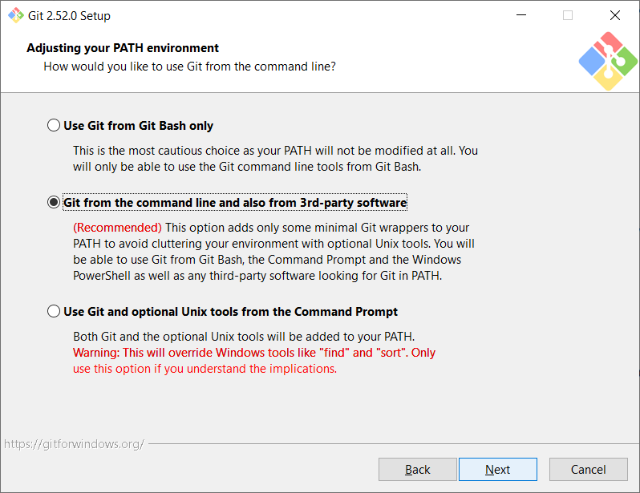  
<br>*Скриншот 43: «Настройка переменной PATH для Git» — три варианта использования Git из командной строки.*

### 9. Выбор SSH‑исполняемого файла

- Выбрать SSH‑клиент, который будет использоваться для безопасных соединений (например, при работе с удалёнными репозиториями GitHub/GitLab).
- Рекомендуемый вариант: **«Use bundled OpenSSH»**.

<br>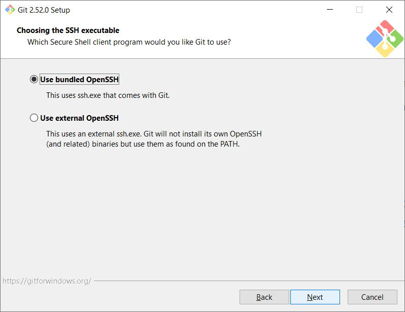  
<br>*Скриншот 44: «Выбор SSH‑исполняемого файла для Git» — выбор между встроенным и внешним OpenSSH.*

### 10. Выбор библиотеки для HTTPS‑соединений

- Выбрать библиотеку для работы с HTTPS‑протоколом.
- Рекомендуемый вариант: **OpenSSL**.

<br>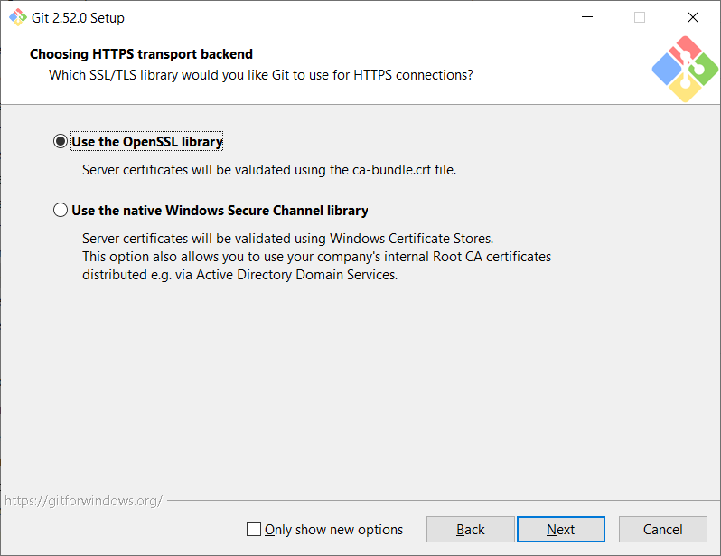  
<br>*Скриншот 45: «Выбор библиотеки для HTTPS‑транспорта Git» — опции выбора HTTPS‑библиотеки.*

### 11. Настройка преобразования окончаний строк

- Настроить обработку окончаний строк при работе с файлами.
- Рекомендуется выбрать опцию: **«Checkout Windows-style, commit Unix-style line endings»**.

<br>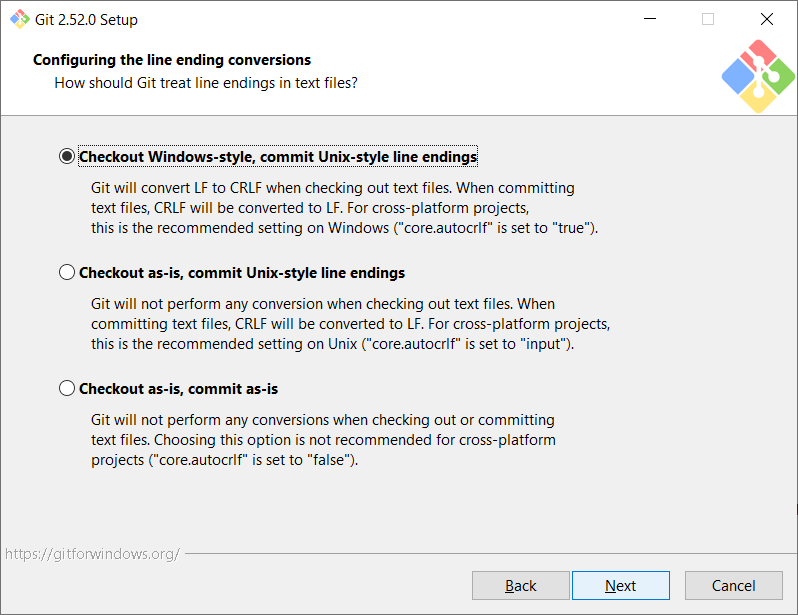  
<br>*Скриншот 46: «Настройка преобразования окончаний строк» — опции обработки переводов строк.*

### 12. Выбор эмулятора терминала для Git Bash

- Выбрать тип эмулятора терминала для Git Bash.
- По умолчанию предлагается **MinTTY** — этот вариант рекомендуется к использованию.

<br>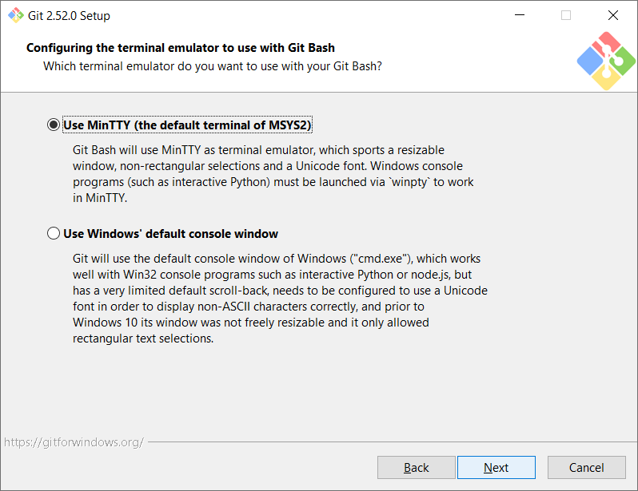  
<br>*Скриншот 47: «Выбор эмулятора терминала для Git Bash» — выбор между MinTTY и консолью Windows.*

### 13. Настройка поведения команды `git pull` по умолчанию

- Выбрать стратегию поведения команды `git pull`.
- Рекомендуемый вариант: **Fast‑forward or merge**.

<br>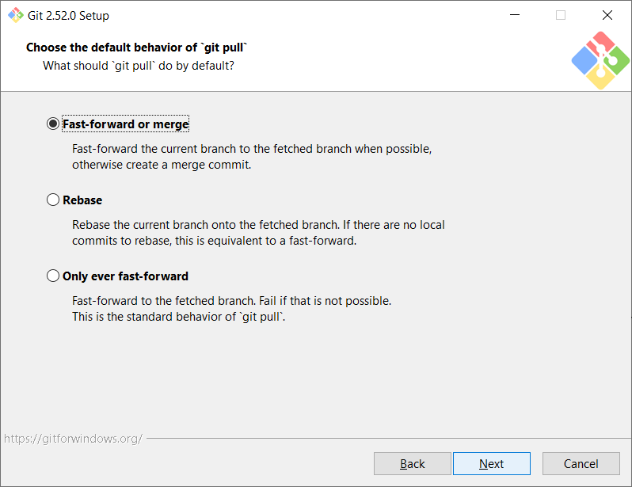  
<br>*Скриншот 48: «Настройка поведения git pull по умолчанию» — выбор одного из трёх вариантов поведения команды.*

### 14. Выбор помощника учётных данных (Credential Helper)

- Выбрать способ хранения учётных данных для доступа к удалённым репозиториям (GitHub, GitLab, Bitbucket и др.).
- Рекомендуемый вариант: **Git Credential Manager**.

<br>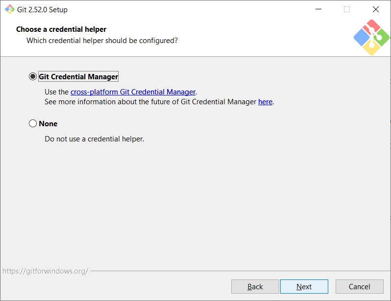  
<br>*Скриншот 49: «Выбор помощника учётных данных Git» — выбор между Git Credential Manager и отсутствием помощника.*

### 15. Настройка дополнительных опций

- Выбрать дополнительные опции для включения.
- Рекомендуемый вариант: **Enable file system caching**.

<br>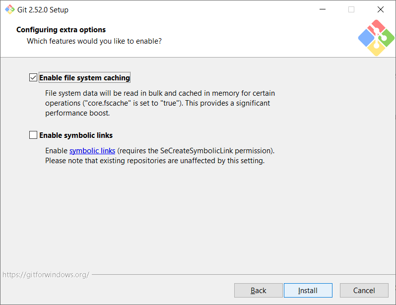  
<br>*Скриншот 50: «Настройка дополнительных опций Git» — список дополнительных функций.*

### 16. Начало процесса установки

- Начать установку Git с выбранными параметрами.
- Появится окно с индикатором прогресса установки.

<br>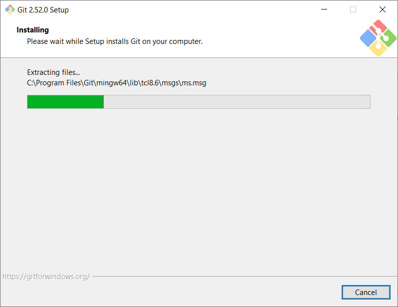
<br>*Скриншот 51: «Процесс установки Git» — окно с индикатором выполнения установки.*

### 17. Завершение установки Git

- После успешной установки появится окно с сообщением об окончании процесса.
- Поставить галочку в чекбоксе **«Launch Git Bash»** для автоматического запуска Git Bash после установки.
- Нажать кнопку **«Finish»**.

<br>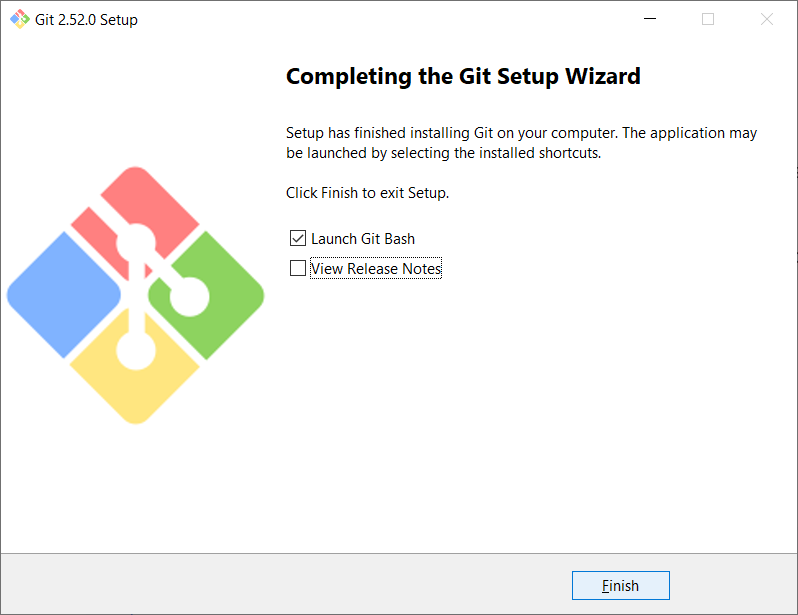  
<br>*Скриншот 52: «Завершение установки Git» — финальное окно установщика с отмеченным пунктом «Launch Git Bash».*

### 18. Запуск Git Bash

- После завершения установки Git Bash запустится автоматически.
- Откроется окно терминала с приглашением командной строки, где можно вводить команды Git.

<br>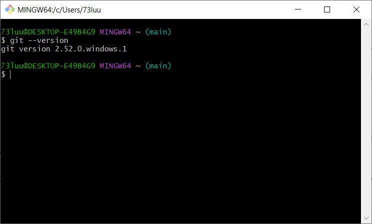  
<br>*Скриншот 53: «Окно Git Bash после установки» — запущенный терминал Git Bash.*

###  Настройка Git после установки

### 19. Начальная настройка глобальных параметров Git, редактора по умолчанию (опционально)

В открывшемся окне Git Bash выполнить команды для настройки пользовательских данных:

```bash
git config --global user.name "ИМЯ_ФАМИЛИИ_ЛАТИНИЦЕЙ"
git config --global user.email "ВАШ_ЕМЕЙЛ@example.com"
```

Если вы не хотите использовать Vim в качестве редактора по умолчанию, можно указать другой редактор — например, Notepad.

**Команда для настройки:**
```bash
git config --global core.editor notepad
```
<br>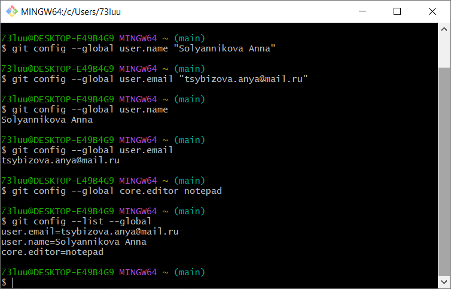  
<br>*Скриншот 54: «Настройка глобальных параметров Git и редактора по умолчанию для Git» — выполнение команд git config --global для установки имени и email, установка Notepad в качестве редактора.*

### 20. Генерация SSH-ключа с установкой парольной фразы

Для безопасного подключения к удалённым репозиториям по протоколу SSH необходимо сгенерировать защищённую пару ключей.

Выполнены следующие команды в Git Bash:

#### Шаг 1: Переход в директорию SSH

```bash
cd ~/.ssh
```
Переход в домашнюю директорию пользователя для управления SSH-ключами.

#### Шаг 2: Просмотр существующих файлов

```bash
ls
```
Проверка существующих SSH-файлов: обнаружены директория **agent/** и файлы **known_hosts**.

#### Шаг 3: Генерация защищённого SSH-ключа

```bash
ssh-keygen -t ed25519 -C "tsybizova.anya@mail.ru"
```
Создание защищённой пары SSH-ключей с использованием современного алгоритма Ed25519

<br>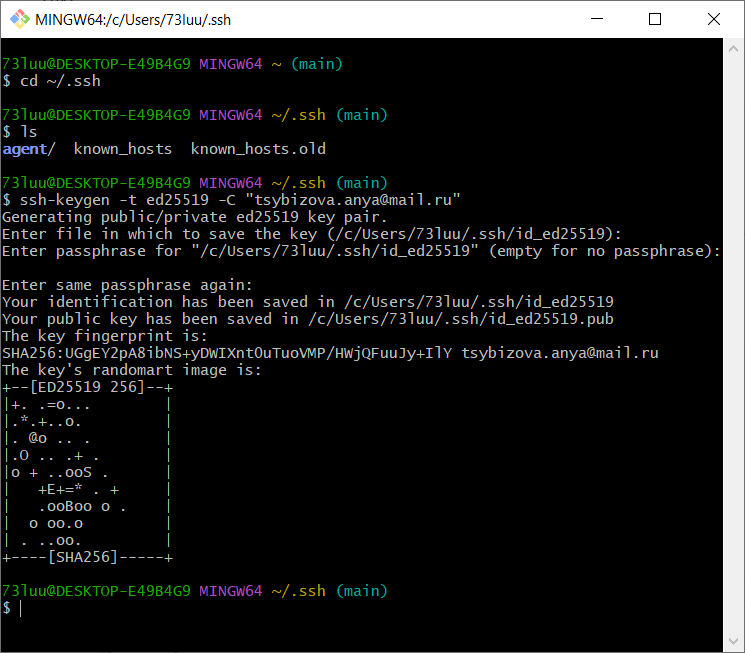
<br>*Скриншот 55: «Процесс генерации защищённого SSH-ключа» — создание SSH-пары с установкой парольной фразы для повышенной безопасности*

### 21. Настройка SSH-агента для управления ключами

#### Шаг 1: Запуск SSH-агента

```bash
eval "$(ssh-agent -s)"
```
Инициализация SSH-агента в текущей сессии терминала. Агент запущен с идентификатором процесса (PID) 1170.

#### Шаг 2: Добавление SSH-ключа в агент

```bash
ssh-add ~/.ssh/id_ed25519
```
Добавление сгенерированного ранее защищённого SSH-ключа в менеджер ключей.

<br>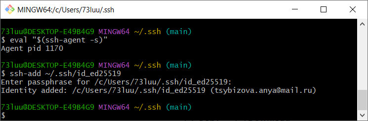
<br>*Скриншот 57: «Настройка SSH-агента для управления ключами» — запуск ssh-agent и добавление защищённого SSH-ключа*

### 22. Получение публичного SSH-ключа для настройки Git-хостинга

#### Шаг 1: Просмотр публичного SSH-ключа

```bash
cat ~/.ssh/id_ed25519.pub
```
Отображение содержимого файла публичного ключа.

#### Шаг 2: Копирование ключа в буфер обмена Windows

```bash
cat ~/.ssh/id_ed25519.pub | clip
```
Использование команды clip для переноса содержимого публичного ключа в системный буфер обмена Windows.

<br>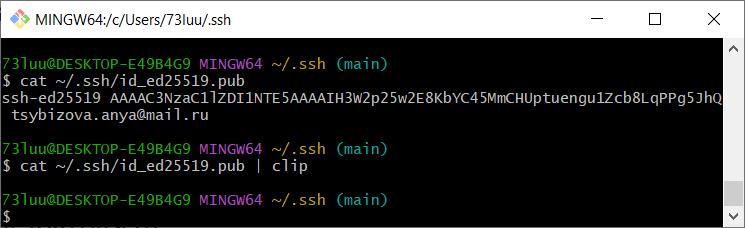
<br>*Скриншот 58: «Извлечение и копирование публичного SSH-ключа» — просмотр и копирование ключа в буфер обмена для добавления в Git-хостинги*

### 23. Добавление SSH-ключа в аккаунт GitHub

- Для настройки безопасного доступа к репозиториям GitHub необходимо добавить публичный SSH-ключ в настройки аккаунта
- Скриншот демонстрирует процесс добавления ключа в разделе SSH and GPG keys личного кабинета GitHub

<br>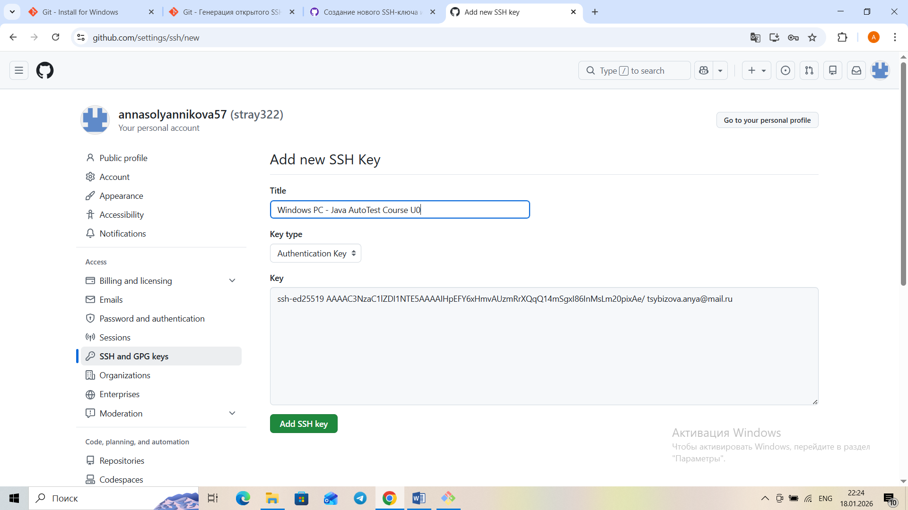
<br>*Скриншот 59: «Добавление SSH-ключа в настройки GitHub» — форма добавления нового SSH-ключа в личном кабинете GitHub*

### 24. Проверка SSH-подключения к GitHub и управление SSH-агентом

- Для подтверждения корректной настройки SSH-ключа выполнена проверка подключения к GitHub
- Скриншот демонстрирует успешное завершение процесса настройки SSH-аутентификации

Выполненная команда:

```bash
ssh -T git@github.com
```
Тестовое подключение к GitHub по протоколу SSH для проверки корректности настроенного ключа.

<br>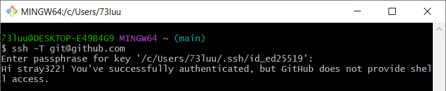
<br>*Скриншот 60: «Проверка SSH-подключения к GitHub» — успешная аутентификация и подтверждение работоспособности SSH-ключа*

---